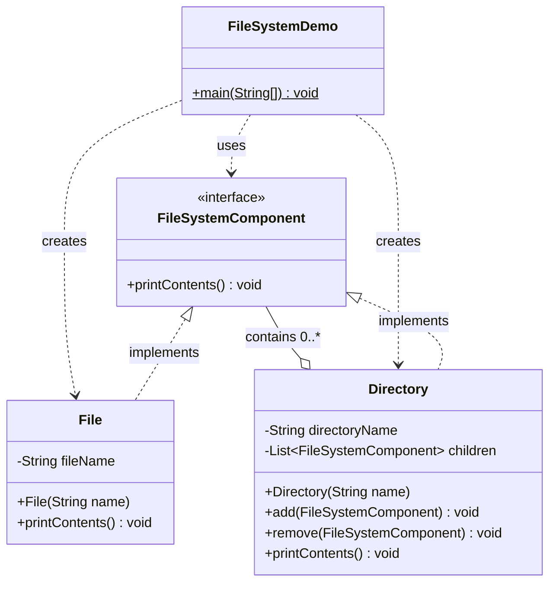
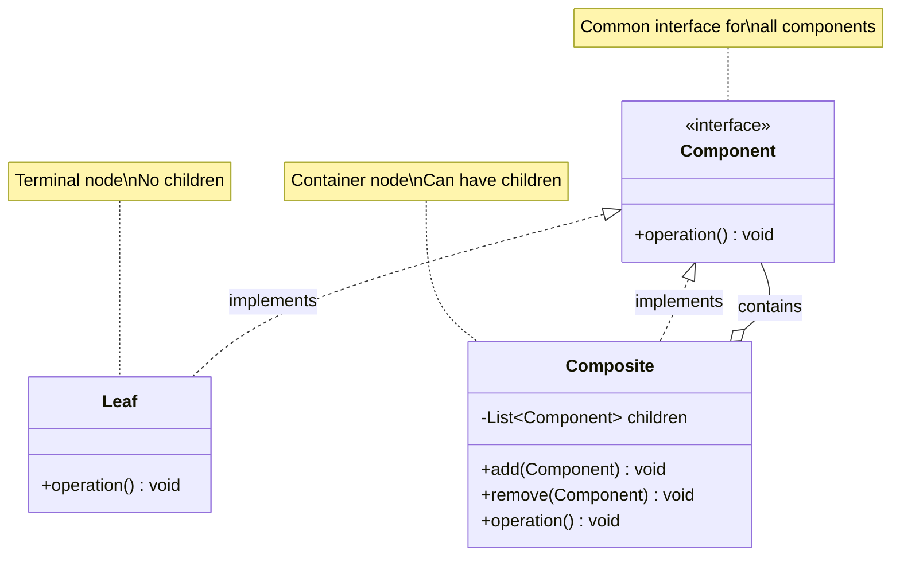
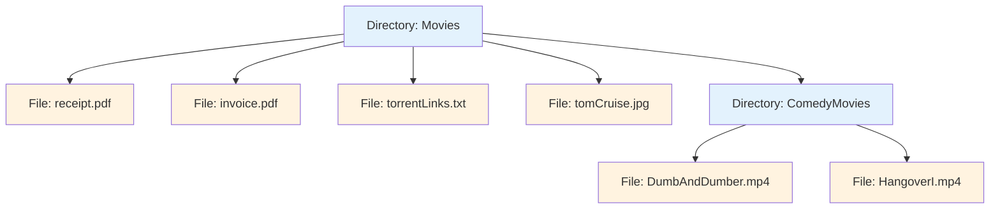
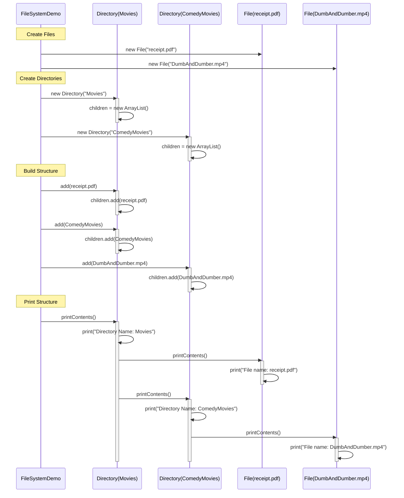
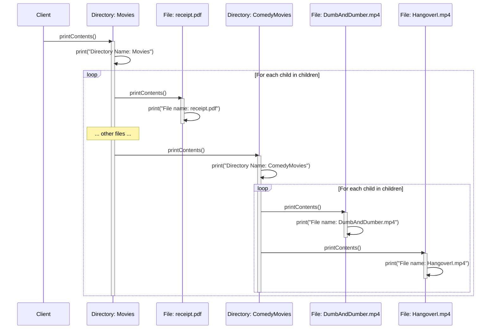

# File System - Design Documentation

## Requirements

### Functional Requirements
1. **Hierarchical Structure**: Support tree-like file system structure
2. **Uniform Interface**: Treat files and directories uniformly
3. **Add/Remove Operations**: Add or remove files/directories from directories
4. **Traversal**: Print entire directory structure recursively
5. **Nesting Support**: Allow unlimited nesting of directories

### Non-Functional Requirements
1. **Simplicity**: Easy to understand and use
2. **Extensibility**: Easy to add new file system components
3. **Maintainability**: Clean code structure
4. **Flexibility**: Support various file system operations uniformly

## Objectives

### Primary Objectives
1. **Implement Composite Pattern**: Treat individual objects and compositions uniformly
2. **Hierarchical Structure**: Build tree-like structure of files and directories
3. **Uniform Operations**: Apply same operations on both files and directories
4. **Recursive Traversal**: Navigate and display entire tree structure

### Design Objectives
1. Create a flexible file system representation
2. Minimize code duplication
3. Follow SOLID principles (especially Open/Closed Principle)
4. Use appropriate design pattern for tree structure

## Design Pattern Used

### Composite Pattern (Implemented)
**Purpose**: Compose objects into tree structures to represent part-whole hierarchies. Let clients treat individual objects and compositions uniformly.

**Implementation**:
- **Component Interface**: `FileSystemComponent` defines common interface
- **Leaf**: `File` represents individual file (no children)
- **Composite**: `Directory` represents folder (can contain files and directories)

**How it works**:
```java
// Both File and Directory implement same interface
FileSystemComponent file = new File("document.pdf");
FileSystemComponent directory = new Directory("Documents");

// Both can be treated uniformly
file.printContents();
directory.printContents();

// Directory can contain both files and other directories
directory.add(file);
directory.add(new Directory("Subfolder"));
```

**Benefits**:
- **Uniform Treatment**: Files and directories treated the same way
- **Tree Structure**: Naturally represents hierarchical file systems
- **Extensibility**: Easy to add new component types (e.g., SymbolicLink, ShortCut)
- **Simplifies Client Code**: Client doesn't need to distinguish between leaf and composite
- **Recursive Operations**: Operations automatically propagate through tree

**Structure**:
```
Movies/
├── receipt.pdf
├── invoice.pdf
├── torrentLinks.txt
├── tomCruise.jpg
└── ComedyMovies/
    ├── DumbAndDumber.mp4
    └── HangoverI.mp4
```

## UML Class Diagram



## Composite Pattern Structure Diagram



## File System Tree Structure



## Sequence Diagram - Building File System



## Sequence Diagram - Recursive Print Operation



## Class Responsibilities

### FileSystemComponent (Component Interface)
- **Purpose**: Define common interface for all file system components
- **Responsibilities**:
  - Declare `printContents()` operation
  - Enable uniform treatment of files and directories
- **Pattern Role**: Component in Composite Pattern
- **Implementation**: Java interface

### File (Leaf)
- **Purpose**: Represent individual file (terminal node)
- **Responsibilities**:
  - Store file name
  - Implement `printContents()` to display file name
  - Cannot contain other components
- **Pattern Role**: Leaf in Composite Pattern
- **Key Characteristics**:
  - No children
  - Terminal node in tree
  - Simple implementation

### Directory (Composite)
- **Purpose**: Represent folder that can contain files and subdirectories
- **Responsibilities**:
  - Store directory name
  - Maintain list of children (files and subdirectories)
  - Implement `add()` to add components
  - Implement `remove()` to remove components
  - Implement `printContents()` to recursively display structure
- **Pattern Role**: Composite in Composite Pattern
- **Key Characteristics**:
  - Can have children
  - Container node in tree
  - Recursive operations

### FileSystemDemo (Client)
- **Purpose**: Demonstrate composite pattern usage
- **Responsibilities**:
  - Create file and directory objects
  - Build hierarchical structure
  - Display complete structure
- **Pattern Role**: Client in Composite Pattern

## Key Operations

### add(FileSystemComponent)
**Purpose**: Add a component to directory

**Implementation**:
```java
public void add(FileSystemComponent fileSystemComponent) {
    children.add(fileSystemComponent);
}
```

**Behavior**:
- Only available in Directory (Composite)
- Not applicable to File (Leaf)
- Adds component to children list

### remove(FileSystemComponent)
**Purpose**: Remove a component from directory

**Implementation**:
```java
public void remove(FileSystemComponent fileSystemComponent) {
    children.remove(fileSystemComponent);
}
```

**Behavior**:
- Only available in Directory (Composite)
- Not applicable to File (Leaf)
- Removes component from children list

### printContents()
**Purpose**: Display component information

**File Implementation**:
```java
public void printContents() {
    System.out.println("File name: " + fileName);
}
```

**Directory Implementation**:
```java
public void printContents() {
    System.out.println("Directory Name: " + directoryName);
    for (FileSystemComponent child : children) {
        child.printContents();  // Recursive call
    }
}
```

**Behavior**:
- File: Prints file name
- Directory: Prints directory name, then recursively prints all children
- Automatic tree traversal

## Relationship Types

| From | To | Relationship | Type | Description |
|------|-----|--------------|------|-------------|
| FileSystemComponent | File | Implementation | implements | File realizes Component interface |
| FileSystemComponent | Directory | Implementation | implements | Directory realizes Component interface |
| Directory | FileSystemComponent | Aggregation | contains 0..* | Directory contains list of components |
| FileSystemDemo | FileSystemComponent | Dependency | uses | Client uses interface |
| FileSystemDemo | File | Dependency | creates | Client creates files |
| FileSystemDemo | Directory | Dependency | creates | Client creates directories |

## Key Design Insights

### Strengths
1. **Uniform Interface**: Files and directories treated identically
2. **Tree Structure**: Naturally represents hierarchical systems
3. **Recursive Operations**: Operations automatically propagate
4. **Extensibility**: Easy to add new component types
5. **Simple Client Code**: Client doesn't distinguish between leaf and composite
6. **Open/Closed Principle**: Open for extension, closed for modification

### Current Implementation
1. **Single Operation**: Only supports `printContents()`
2. **Simple Structure**: Basic file/directory representation
3. **No Metadata**: No file size, permissions, dates, etc.
4. **No Search**: No search or filter operations
5. **Print-Only**: Only displays structure, no other operations

### Potential Enhancements

#### 1. Additional Operations
```java
public interface FileSystemComponent {
    void printContents();
    long getSize();
    void search(String keyword);
    void delete();
    void rename(String newName);
}
```

#### 2. Visitor Pattern for Operations
```java
interface FileSystemVisitor {
    void visit(File file);
    void visit(Directory directory);
}

class SizeCalculatorVisitor implements FileSystemVisitor {
    private long totalSize = 0;
    
    public void visit(File file) {
        totalSize += file.getSize();
    }
    
    public void visit(Directory directory) {
        for (FileSystemComponent child : directory.children) {
            child.accept(this);
        }
    }
}
```

#### 3. Iterator Pattern for Traversal
```java
interface FileSystemIterator {
    boolean hasNext();
    FileSystemComponent next();
}

class DepthFirstIterator implements FileSystemIterator { }
class BreadthFirstIterator implements FileSystemIterator { }
```

#### 4. Decorator Pattern for Permissions
```java
abstract class FileSystemDecorator implements FileSystemComponent {
    protected FileSystemComponent component;
}

class ReadOnlyDecorator extends FileSystemDecorator { }
class EncryptedDecorator extends FileSystemDecorator { }
```

#### 5. Add Metadata
```java
public class File implements FileSystemComponent {
    private String fileName;
    private long size;
    private Date createdDate;
    private Date modifiedDate;
    private String permissions;
    private String owner;
}

public class Directory implements FileSystemComponent {
    private String directoryName;
    private List<FileSystemComponent> children;
    private Date createdDate;
    private String permissions;
    private String owner;
}
```

## Composite Pattern Variations

### Safety vs Transparency Trade-off

**Current Implementation (Transparency)**:
- `add()` and `remove()` in Directory class only
- Client must know component type to add children
- Type-safe but less transparent

**Alternative (Full Transparency)**:
```java
public interface FileSystemComponent {
    void printContents();
    void add(FileSystemComponent component);  // In interface
    void remove(FileSystemComponent component);  // In interface
}

public class File implements FileSystemComponent {
    public void add(FileSystemComponent component) {
        throw new UnsupportedOperationException("Cannot add to file");
    }
}
```

**Trade-off**:
- Transparency: Client treats all components uniformly
- Safety: Compile-time errors vs runtime errors

## Testing Scenarios

### Basic Structure Test
**Setup**:
```java
File file1 = new File("document.pdf");
Directory dir1 = new Directory("Documents");
dir1.add(file1);
```

**Expected Output**:
```
Directory Name: Documents
File name: document.pdf
```

### Nested Structure Test (Actual Implementation)
**Setup**:
```java
Directory movies = new Directory("Movies");
Directory comedy = new Directory("ComedyMovies");
File receipt = new File("receipt.pdf");
File dumb = new File("DumbAndDumber.mp4");

movies.add(receipt);
movies.add(comedy);
comedy.add(dumb);
```

**Expected Output**:
```
Directory Name: Movies
File name: receipt.pdf
Directory Name: ComedyMovies
File name: DumbAndDumber.mp4
```

### Deep Nesting Test
**Setup**:
```java
Directory root = new Directory("root");
Directory level1 = new Directory("level1");
Directory level2 = new Directory("level2");
File deepFile = new File("deep.txt");

root.add(level1);
level1.add(level2);
level2.add(deepFile);
```

**Expected Output**:
```
Directory Name: root
Directory Name: level1
Directory Name: level2
File name: deep.txt
```

### Mixed Content Test
**Setup**:
```java
Directory projects = new Directory("Projects");
projects.add(new File("README.md"));
projects.add(new File("LICENSE"));
Directory src = new Directory("src");
src.add(new File("Main.java"));
projects.add(src);
```

**Expected Output**:
```
Directory Name: Projects
File name: README.md
File name: LICENSE
Directory Name: src
File name: Main.java
```

## Real-World Applications

### 1. File Systems
- Operating system file management (Windows Explorer, Finder)
- Cloud storage systems (Google Drive, Dropbox)
- Version control systems (Git directory structure)

### 2. UI Component Trees
- GUI frameworks (Swing, JavaFX)
- HTML DOM structure
- React component trees

### 3. Organization Hierarchies
- Company organizational charts
- Military command structures
- Menu systems

### 4. Document Structures
- XML/HTML document trees
- Book chapters and sections
- Folder-based note applications

## Advantages of Composite Pattern

1. **Simplifies Client Code**: Client treats all objects uniformly
2. **Easy to Add New Components**: Open/Closed Principle
3. **Recursive Structure**: Natural fit for tree-like structures
4. **Flexible Composition**: Build complex hierarchies from simple parts
5. **Single Responsibility**: Each component handles its own behavior

## Disadvantages of Composite Pattern

1. **Overly General**: Hard to restrict component types in composite
2. **Runtime Type Checking**: May need to check types at runtime
3. **Memory Overhead**: Composite stores references to children
4. **Difficult to Maintain Constraints**: Hard to enforce specific structures

## Conclusion

This file system implementation effectively demonstrates the **Composite Pattern**, providing:
- Uniform treatment of files and directories
- Natural representation of hierarchical structure
- Recursive operations that automatically propagate through tree
- Clean and maintainable code structure
- Foundation for building complex file system operations

The pattern is extensible and can be enhanced with additional operations, metadata, and complementary patterns like Visitor for complex traversals and Iterator for flexible tree navigation.
